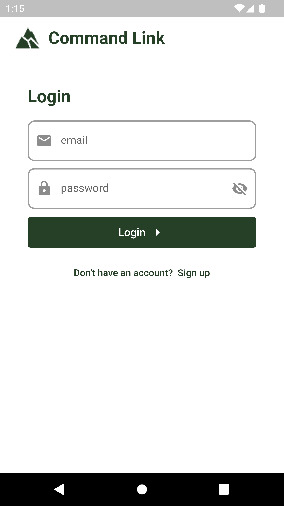
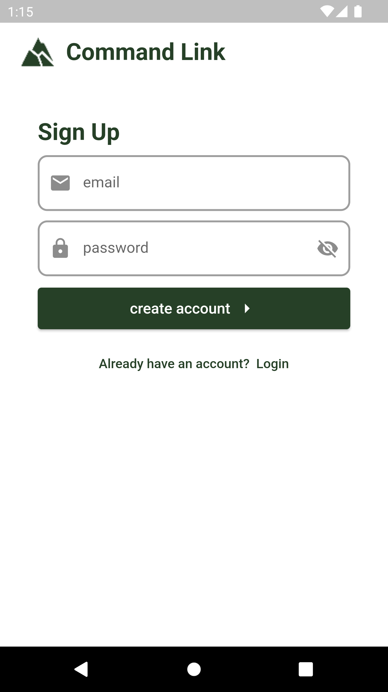
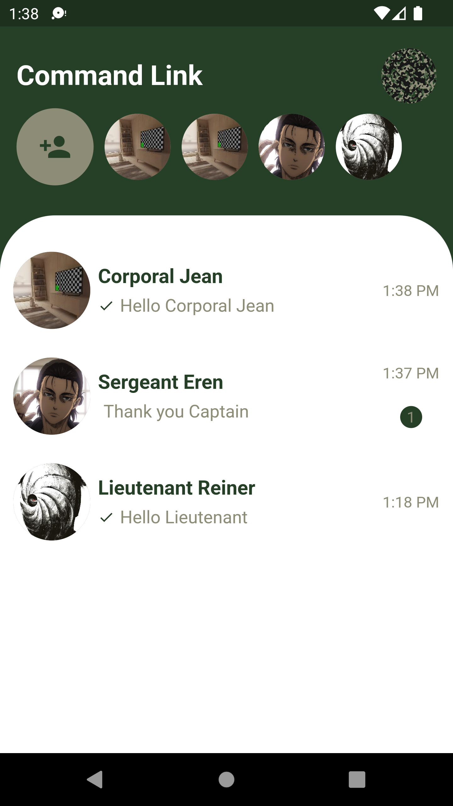
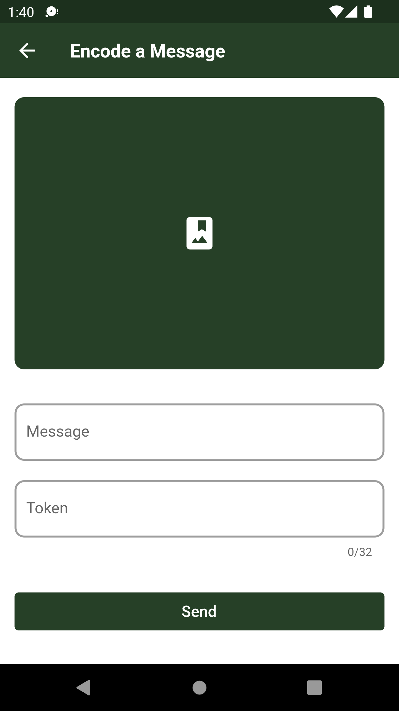
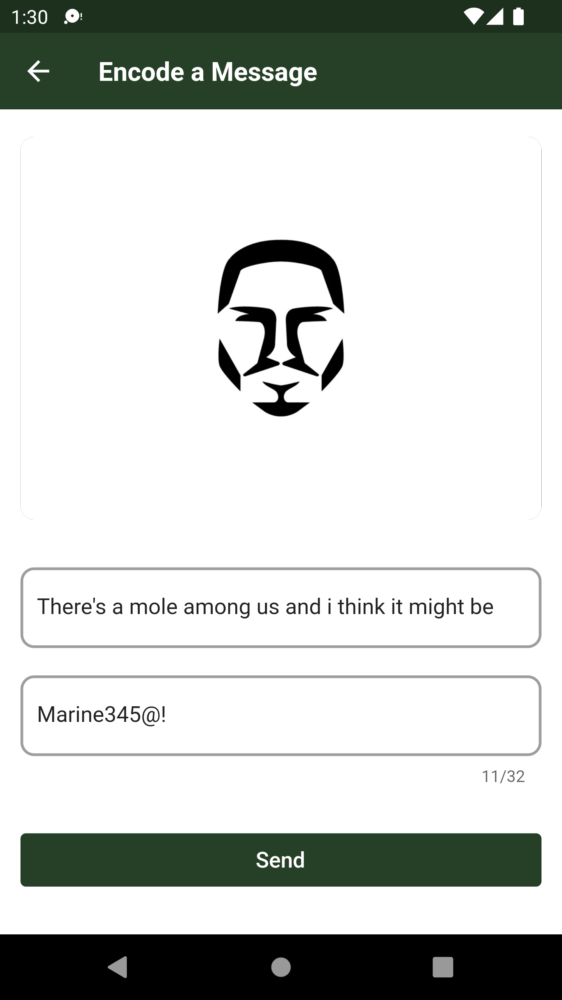
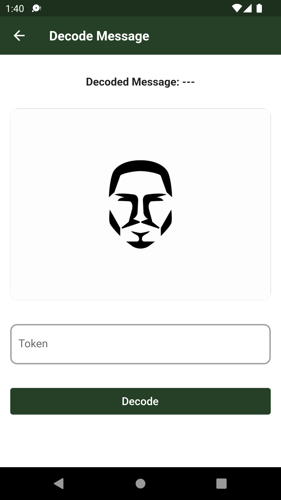
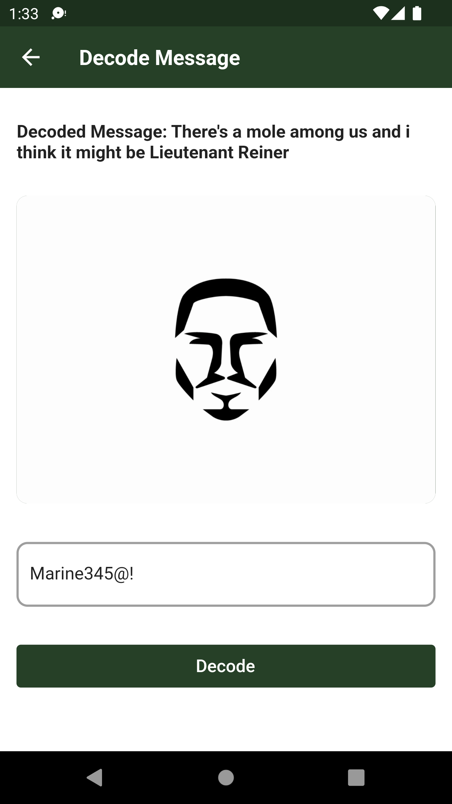
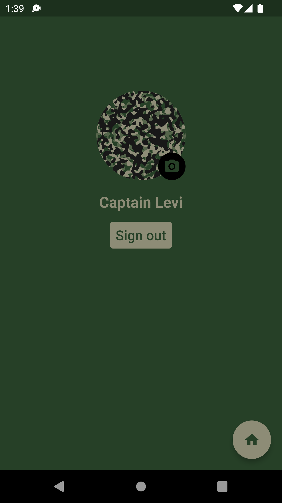
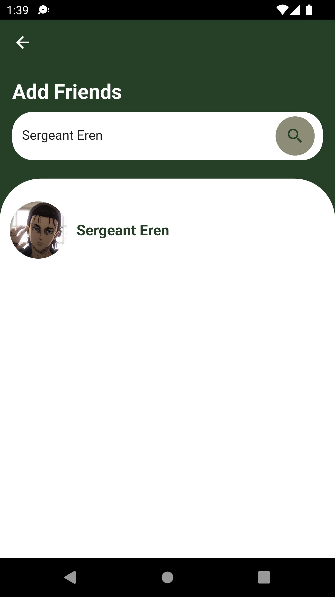

# CommandLink


A realtime secure communication application for high-security environments, combining end-to-end AES encryption with LSB steganography for covert message concealment.

---

## About The Project

CommandLink was built to solve a specific security problem: how do you build a mobile communication tool for personnel operating in high-threat environments, where not only the content of messages but the existence of communication itself must be protected?

The answer is a two-layer security architecture. The first layer — AES encryption via the Dart `cryptography` package — ensures that message content is unreadable to any party that intercepts it in transit. The second layer — LSB (Least Significant Bit) steganography via the Dart `steganography` package — embeds the encrypted messages within image files, making the communication invisible to a passive observer who sees only ordinary images being shared.

Built with Flutter for cross-platform deployment (Android, iOS, Web, Windows) and Firebase for realtime infrastructure.

---

## Security Architecture

### Layer 1 — AES Encryption

Messages are encrypted client-side using AES (Advanced Encryption Standard) via the Dart `cryptography` package before any data leaves the device. The encryption process occurs entirely on the sender's device, meaning the Firebase backend never receives plaintext message content.

- **Package:** [cryptography](https://pub.dev/packages/cryptography)
- **Algorithm:** AES — symmetric block cipher, industry standard for secure communications
- **Client-side:** Encryption occurs before the message is passed to the steganography layer
- **Client-side:** Decryption occurs after steganographic extraction on the recipient's device

### Layer 2 — LSB Steganography

The AES-encrypted message is then embedded within an image file using LSB (Least Significant Bit) steganography via the Dart `steganography` package. LSB steganography works by replacing the least significant bit of selected pixel values in the image with bits from the encrypted message. The modification to pixel values is imperceptible to the human eye — the image appears completely normal — but the message data is recoverable by the intended recipient.

- **Package:** [steganography](https://pub.dev/packages/steganography)
- **Technique:** LSB (Least Significant Bit) encoding in image pixel data
- **Carrier:** PNG image files (lossless compression preserves hidden data integrity)
- **Output:** A visually identical image containing the hidden encrypted message

### Why Two Layers?

Encryption alone protects message content but reveals that a communication occurred. An adversary monitoring network traffic can see that two parties are exchanging encrypted data, even if they cannot read it. Steganography addresses this by concealing the communication within ordinary image files — to an outside observer, two users are simply sharing photos.

The combination creates **defence in depth**: an adversary must first detect that steganography is being used (steganalysis), then separately break the AES encryption layer. This dual-layer approach is aligned with the principle of defence in depth, a core concept in NCSC guidance on secure communications design.

---

## Threat Model

CommandLink was designed against the following threat scenarios:

| Threat | Mitigation |
|--------|-----------|
| Passive eavesdropping | AES encryption renders intercepted data unreadable |
| Metadata analysis | Steganographic carrier (images) blends with normal traffic, reducing communication signature |
| Man-in-the-middle | Client-side encryption before transmission; intercepted messages cannot be decrypted without key |
| Unauthorised server access | Firebase stores only encrypted steganographic images, never plaintext or keys |

---

## Technical Stack

| Component | Technology | Purpose |
|-----------|-----------|---------|
| Mobile Framework | Flutter (Dart) | Cross-platform — Android, iOS, Web, Windows |
| Encryption | [cryptography](https://pub.dev/packages/cryptography) | AES client-side message encryption |
| Steganography | [steganography](https://pub.dev/packages/steganography) | LSB embedding of encrypted messages in images |
| Realtime Database | Cloud Firestore | Message delivery and synchronisation |
| Authentication | Firebase Auth | Google Sign-In and user identity |

---

## Features

- 🔒 **AES encryption** — applied client-side before any data leaves the device
- 🖼️ **LSB steganography** — encode encrypted messages within image files  
- 🔍 **Steganographic decode** — extract and decrypt hidden messages from images
- 💬 **Realtime messaging** — Firebase Cloud Firestore synchronisation
- 🔐 **Google Sign-In** — authentication via Firebase Auth
- 📱 **Cross-platform** — Android, iOS, Web, and Windows from a single codebase
- 👤 User profiles, search, and notifications

---

## Design Decisions

**Why Flutter?**  
Flutter enables a single Dart codebase to deploy across Android, iOS, Web, and Windows. For a security-focused communication tool, maintaining a single codebase reduces the attack surface — a vulnerability patched once is patched everywhere.

**Why Firebase?**  
Firebase Cloud Firestore provides realtime sync with offline capability, critical for users in environments with intermittent connectivity. Firebase Auth provides robust identity management without a custom authentication backend, reducing the custom code surface that could introduce vulnerabilities.

**Why the `cryptography` package?**  
The Dart `cryptography` package provides a clean API for AES and is maintained as a cross-platform pure Dart implementation, enabling consistent behaviour across all Flutter target platforms without native plugin dependencies.

**Why LSB steganography?**  
LSB steganography produces visually indistinguishable output from the carrier image and is computationally inexpensive on mobile hardware. PNG carrier format was chosen for lossless compression — JPEG compression would corrupt the embedded data by modifying the pixel values the hidden bits depend on.

---

## Screenshots

| | | |
|--|--|--|
| Login | Signup | Chat |
|  |  |  |
| Encode Message | Encoded Output | Decode Message |
|  |  |  |
| Decoded Output | Profile | Search |
|  |  |  |

---

## Installation

```bash
# Clone the repository
git clone https://github.com/aladeenuthy/CommandLink.git
cd CommandLink

# Install dependencies
flutter pub get
```

**Configure Firebase:**
1. Create a Firebase project at [console.firebase.google.com](https://console.firebase.google.com)
2. Enable Cloud Firestore, Firebase Auth (Google Sign-In)
3. Download `google-services.json` (Android) → place in `android/app/`
4. Download `GoogleService-Info.plist` (iOS) → place in `ios/Runner/`

```bash
# Run the application
flutter run
```

---

## Built With

- [Flutter](https://flutter.dev) — UI framework
- [Firebase](https://firebase.google.com) — Backend infrastructure  
- [cryptography](https://pub.dev/packages/cryptography) — AES encryption
- [steganography](https://pub.dev/packages/steganography) — LSB steganography

---

*Built by [Abdulmalik Uthman](https://github.com/aladeenuthy)*
